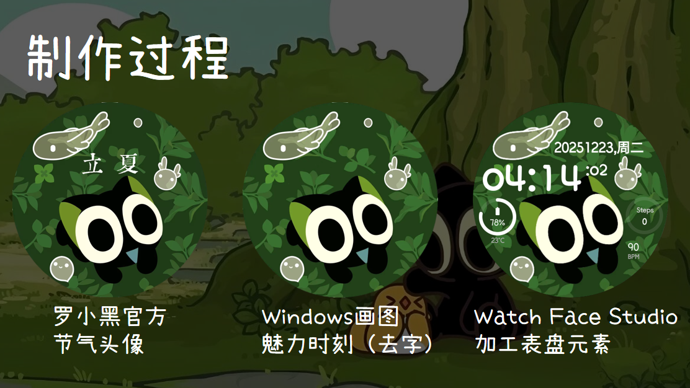

# LXH_立夏 - 罗小黑主题安卓智能手表表盘

[https://img.shields.io/badge/语言-中文-blue](https://github.com/Arpx4kun/LXH_Lixia_Watchface)

这是我“考古”出的四年前高中时期自己制作的一款罗小黑主题安卓智能手表表盘。

## 表盘元素
表盘能清晰显示以下关键信息：
- **时间** (时、分、秒)
- **设备电量**
- **CPU 温度**
- **当前日期**
- **今日步数**
- **近期心率**

## 主题版本
本次分享包含两个版本，满足不同喜好：
1.  **原版主题**：我比较喜欢的原版设计风格。
2.  **像素字体版**：采用像素风格字体。

## 已经测试
- **演示设备**：三星 Galaxy Watch 4 Classic
- **演示平台**：Wear OS
- 理论上比较新的圆屏安卓手表都能用。

## 项目“考古”小记
- **制作时间**：2021-12-21
- 那是已经逐渐陌生的高中时光…刚好是四年前的这个时间啊！
- **开发平台**：三星 Watch Face Studio

## 下载与安装

### 下载
**GitHub 仓库地址**：
> https://github.com/Arpx4kun/LXH_Lixia_Watchface
> （若访问失败，请搜索“Github 访问教程”解决网络问题。）

进入上述链接，在 Releases 或相应目录中下载你喜欢的版本（.apk 文件）即可。

### 安装方法
请根据你的设备情况，选择以下任一工具将 APK 文件安装到手表：

1.  **WearOS 工具箱** (推荐安卓手机用户使用)
    - 官网：https://wearosbox.com/zh/

2.  **安卓手表 ADB 实用工具箱** (Windows 电脑用户可选)
    - 介绍与下载：https://www.bilibili.com/opus/1147633094199607305

3.  **直接使用 ADB 工具** (最通用，除 iOS 外均可)
    - 需一定的命令行操作知识。

> **核心步骤**：无论使用哪种工具，最终目标都是将下载的 `.apk` 文件安装（ADB Install）到已通过调试模式连接到电脑/手机的手表上。

## 相关资源
- 本表盘使用的罗小黑节气图和头像合集：https://www.bilibili.com/opus/290778198000020966

---
**祝你用得开心！**

arpx4kun
2025年12月23日 整理发布
